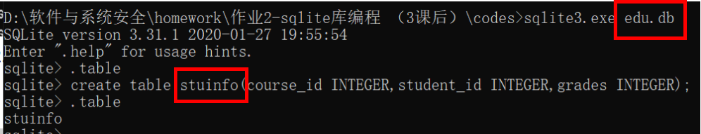
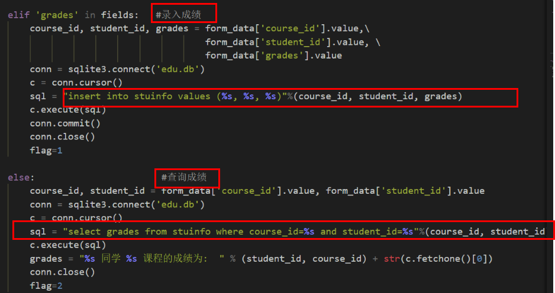
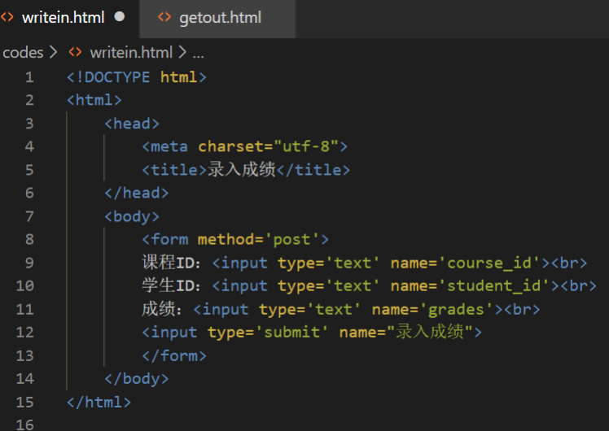
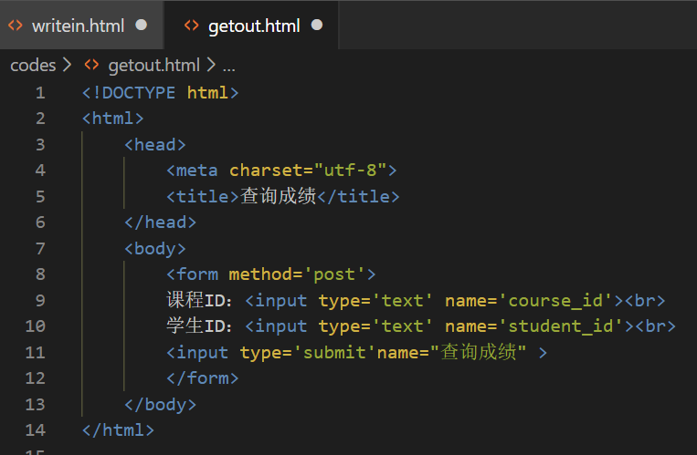
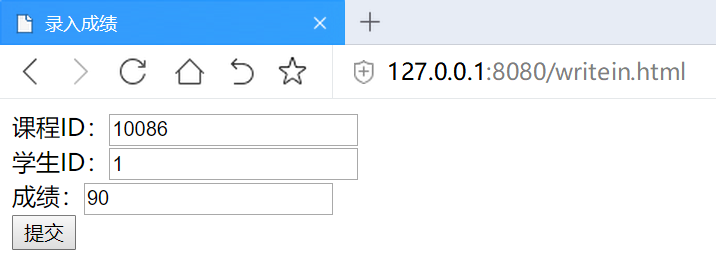
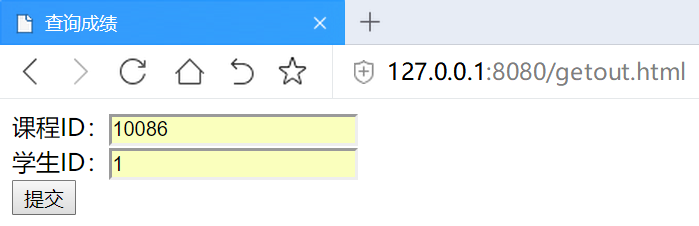
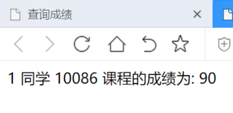

# 作业-sqlite库编程
* 在不使用Django的情况下，我们可以使用更底层的pyhton的 来编程操作数据库。
* 可以在上周的httpserver.py的基础上，继续编写漏洞。
  * 写两个页面，一个是教师录入成绩页面，一个是学生查询成绩页面。教师录入成绩页面表单有三个字段，课程id，学生id，成绩。录入提交以后，httpserver调用sqlite库使用sql语句写入数据库。
  * 然后是学生查询成绩表单，学生输入学生id，课程id，httpserver使用sql语句查询成绩后返回给用户。这里不需要做登录功能，课程也用直接输入id而不是下拉菜单的方式，或者其他选择的方式，而是直接输入id。为了体验最原始的web的开发过程。

* 建立数据库
  * sqlite3 edu.db
  * create table studentsinfo(course_id INTEGER,student_id INTEGER,grades INTEGER);  
    
* 学习 sqlite3库的语法：[学习网站](https://docs.python.org/3/library/sqlite3.html)  
  * 修改之前课上的httpserver.py源代码，编写录入成绩和查询成绩的代码    
         
  * 对应的录入界面/查询界面html代码如下  
       
      
* 运行 
  * 录入  
       
  * 提取  
       
      
* 实现了作业要求!