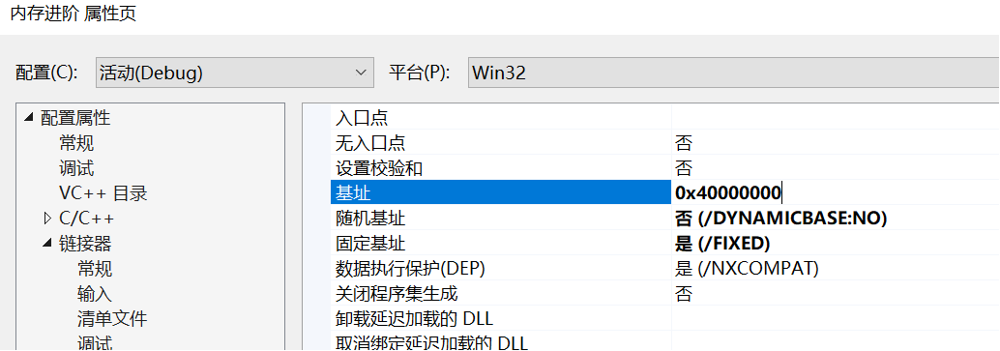
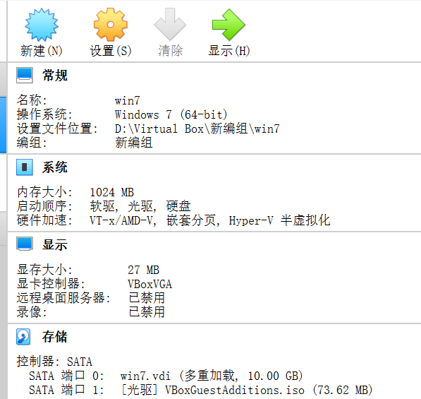

# 课堂+作业
## 课堂
* 要了解底层的操作系统级别的内存管理的原因：
  * 因为在溢出型漏洞攻击中，内存地址的有效性在漏洞利用程序的编写中是首要考虑的问题。漏洞攻击的目的，要驻留在系统内，而不是引起系统的崩溃。
  * 如果对内存访问不对，读写到了不可用的内存地址上。那么引起的效果是崩溃程序退出，那么攻击程序也就退出结束运行了。
  * 所以，攻击程序必须要考虑内存地址的有效性的。
* 我们的应用程序，我们所有编写的exe文件，所有使用的地址，都不是物理地址。而是一套虚拟地址系统。
* 分页表
  * 在OS的内核中，有一个非常重要的数据结构，称为分页表。这个分页表其实就是记录了每个分页地址是否可用的。
  * 它其实还记录了一个非常重要的内容，就是这一块分页，对应的是哪一个物理内存。他们以4KB单位对应。
  * 在真正的数据访问的过程中，每次访问，系统都会去查分页表，把访问的虚拟地址，在分页表中表项的记录中找到这一块虚拟地址分页对应的物理地址分页。分页内部的偏移不会变。
  * 而且，每一个进程都有一个分页表。所以其实可以把不同的进城的相同分页，对应到不同的物理地址上。
  * 在32位系统中。地址空间从0x0-0xFFFFFFFF。一共4GB。也是一个进程最多可以有4GB的内存可用。
  * 但是我们的物理内存并没有那么多。往往一个进程也使用不了4GB这么大的数据。所以，系统是，只用进程需要使用了，才把内存分页的地址对应到物理地址上。有的时候，各个进程所使用的总内存会超过物理内存的总大小。这种情况下，部分分页会被缓存到硬盘上。但是缓存到硬盘上的内存分页数据在使用的时候，又需要载入到物理内存。专业术语叫分页交换 swap。所以，有的时候，跑大型的程序，内存占用很多，超过了物理内存大小，这时候程序仍然能运行，但是变得很慢。就因为系统在不停的进行分页交换，而硬盘的访问比内存的速度差了1-2个数量级。
  * 进程的相同地址的分页可以映射到不同的物理地址上，同样也能映射到相同的物理内存上。比如动态链接库，每个进程都会调用基础的动态链接库，只需要把分页表中项对应过来就好了。让虚拟内存分页对应到已经存在的物理内存分页中。
 
# 作业要求
* 【1】验证不同进程的相同的地址可以保存不同的数据。
  * 在VS中，设置固定基地址，编写两个不同可执行文件。同时运行这两个文件。然后使用调试器附加到两个程序的进程，查看内存，看两个程序是否使用了相同的内存地址；
  * 在不同的进程中，尝试使用VirtualAlloc分配一块相同地址的内存，写入不同的数据。再读出。
* 【2】（难度较高）配置一个Windbg双机内核调试环境，查阅Windbg的文档，了解:
  * Windbg如何在内核调试情况下看物理内存，也就是通过物理地址访问内存
  * 如何查看进程的虚拟内存分页表，在分页表中找到物理内存和虚拟内存的对应关系。然后通过Windbg的物理内存查看方式和虚拟内存的查看方式，看同一块物理内存中的数据情况。
    * 首先需要搭建Windbg的内核调试环境。由于我们直接调试的操作系统内核，所以需要两台计算机安装两个Windows，然后连个计算机使用串口进行链接。
    * 所以我们需要再虚拟机中安装一个Windows（安装镜像自己找，XP就可以），然后通过虚拟串口和host pipe链接的方式，让被调试系统和windbg链接，windbg可以调试。

## 作业【1】
* 在VS中，设置固定基地址，编写两个不同可执行文件。同时运行这两个文件。然后使用调试器附加到两个程序的进程，查看内存，看两个程序是否使用了相同的内存地址；
* 代码：
   ```c
  //test1
  #include<stdio.h>
  int main()
  {
  	printf("test 1");
  }

  //test2
  #include<stdio.h>
  int main()
  {
  	printf("test 2");
  }
  ```
* 设置地址
  * test1和test2的基地址都设置为：
     
* 运行可观察到：两个程序的地址完全相同，但是正常执行，可见不同进程的相同的地址可以保存不同的数据  
     
      
* 在不同的进程中，尝试使用VirtualAlloc分配一块相同地址的内存，写入不同的数据。再读出：
  * 新建两个工程，同时执行以下代码，可以发现写入的内存地址完全相同，写入的内容不同
    * 第一个工程：
            
            
    * 第二个工程： 
  * 两个程序的结果如下
    * 第一个工程的结果：  
             
    * 第二个工程的结果：  
            
  + 可以发现确实在相同的内存存入了不同的数据，具有内存保护

## 作业【2】--- Windbg
* 准备工作
  * 工具：
    * 主机上安装windbg   
        
    * 虚拟机上安装win7系统    
         
    * 为虚拟机配置虚拟串口，为建立 HOST 到 GUEST 的调试通信连接  
          
    * 在虚拟机的cmd中输入以下代码，依次建立启动项，并激活调试模式 
      ```bash
      bcdedit /copy {current} /d "Windwos7"
      bcdedit /debug ON
      bcdedit /bootdebug ON
      bcdedit /timeout 10
      ```
            
    * 执行命令 bcdedit /dbgsettings，显示出使用的第一个串口    
          
    * 在主机进行符号的配置，配置 Windbg 的符号下载地址为：`srv*E:\WinSym*https://msdl.microsoft.com/download/symbols`  
          
* 在主机命令行中切换到WinDBG的根目录下，执行以下命令，连接虚拟机串口进行调试  
  `Windbg.exe -b -k com:port=\\.\pipe\com1,baud=115200,pipe` 
  * 其中`\\.\pipe\com1`是之前在虚拟机设置的链接地址
  * 115200是之前在虚拟机中看到的串口波特率
        
  * 重新启动虚拟机win7系统，在开机的时候选择Windows7 [启用调试程序]，进入调试模式
        
  * 观察主机的WinDbg发现成功连接到虚拟机  
          
  * 可见内核调试环境已经配置成功
* 在虚拟机打开记事本，输入一串字符串“I AM DXY”
        
* 点击WinDbg的break按钮，使操作系统断下来  
        
* 使用 !process 0 0 命令查看当前系统所有进程信息，找到记事本所在进程 但发现出现以下错误  
         
  * 解决办法：
  <table><tr><td bgcolor=yellow>    <font color=red>
  参考了各种各样的办法也解决不了!!!!<br>
  没办法了要疯了<br>
  最终决定借用谌雯馨的实验结果进行理论上的分析
  </font></td></tr></table>
* 谌雯馨使用 !process 0 0 命令查看当前系统所有进程信息，可以找到记事本所在进程  
  * 可以观察到进程块起始地址为882e4030   
    
* 使用.process -i 882e4030(进程块地址)命令切换到记事本的进程
  再输入 g 命令，使用s -u命令再记事本进程中搜索 Hello World! 这个字符串`s -u 0x00000000 L0x01000000 "Hello World!"`     
    
* 观察到有两个地址处都保存有字符串 Hello World！ ，取第一个虚拟地址0x001ee148，求出此地址在计算机内存内所对应的物理地址。
    * 虚拟地址的构成，一个32位的虚拟地址有以下几部分组成：    
      
    + 0x001ee148这个虚拟地址按照上图进行分解可得----- 00(0)-000000000(0)-111101110(0x1EE)-000101001000(0x148)
    + CPU中有一个CR3寄存器保存了当前进程的页目录表的的基址 
      * 通过 r cr3命令查看cr3寄存器的值，得到cr3=7eaf6540，即为页目录的基址
      * 因为页目录表索引为0，所以使用 !dq 7eaf6540+0*8查看页目录的基址  
      
    + 页目录和页表的每一项都是8个字节，其中第12-31位保存了页表的基址。从之前对虚拟地址的分解可知，页目录项的索引为0，也就是是第一项，所以页目录的基址为3a4b6000，而页目录索引为0
      使用`！dq 3a4b6000+0*8`查看页表的基址
      
    + 使用`！dq db9e000+8*0x1ee`找到页基址
      
    + 可以得到物理地址所在页基址为3cefc000，而字节索引为0x148，再使用！db 3cefc000+0x148查看该地址的内容
      
    + 找到了Hello World字符串，即成功地根据虚拟地址通过分页机制找到了物理地址。
  
  