# Fuzzing

## 课堂知识
### 【1】基础知识
* Fuzzing目前也是漏洞挖掘的主要方法之一，是各种漏洞挖掘技术中人力消耗比较低，技术门槛比较低，同时效果却比较好的一种方法。其他的方法，比如程序分析、符号执行等也人在用。但是难度相对较大一些。
* 首先，第一个我们需要确定一个目标。你对什么软件进行漏洞挖掘，软件是做什么的。数据来源是文件还是网络，或者既有文件又有网络。因为我们知道Fuzzing的主要原理就是随机性的大量给被测试软件输入数据。当然首先就需要知道软件是处理什么样的数据的，应该如何给软件输入数据。
* 一般来讲，现在主要就是文件和网络两种。如果是文件型的，最典型的比如Word。那么我们就需要构造大量的文件。如果是网络的，比如一个Web服务器，那么我们就需要构造大量的网络数据包发送给被测试软件。我们一般称为文件型Fuzzing和网络型Fuzzing
* 选定了被测试软件以后，下面就需要构造软件的运行环境。如果是Windows Linux的应用软件，可以直接运行。如果是手机软件，由于手机自带的调试功能比较弱，比方便控制和输入，一般可能需要一个模拟器来运行。
* 有了运行环境以后，下一步，需要选择一个Fuzzing的框架。Fuzzing技术发展了很多年，有很多人已经开发了不少框架。框架已经解决了Fuzzing测试中的一些基本的共性的问题，我们不需要重头开始做。在框架的基础上，我们只需要进行一些配置或者少量的编程就可以开始进行测试了。
* 然后，我们需要选择一种策略。比如是基于生成的还是基于变异的。那什么是基于生成的呢，就是我们的数据完全是重新构造的，不基于一些已有的数据或者模板。当然重新构造的过程中，也不能完全瞎构造，通常有效的测试数据并不是完全畸形的数据，而是半畸形数据。因为完全畸形的数据，可能在到达测试对象之前就已经被丢弃了。比如一个网络数据包，如果不符合数据包的基本格式。连IP地址都不对。那肯定是到不了被测试对象的。所以基于生成的，也需要在规则、协议、文件格式的基础上进行。所以基于生成的策略，一般只对协议已知、格式开放的目标。那么一些位置协议或者格式不清楚的数据，就可以采用基于变异的策略。在已有的合法数据基础上，通过一定的随机性的变化来得到测试数据。已有的合法数据比较容易得到，比如很多年前，Word没有开放doc文件的格式。如果我们要对Word进行Fuzzing，就应该采取基于变异的策略。用Word先保存生产一个合法的doc文件，再在这个合法的doc文件的基础上大量变异，也就是随机性的替换一些数据、插入删除一些片段数据来得到大量的测试数据。同样，如果是对网络程序进行Fuzzing。我们可以让网络程序先正常运行，抓取数据包。然后对抓取的数据包进行重放，重放过程中进行一定比例的变异（随机性的替换、插入、删除）。
* 总之，模糊测试技术是一种通过注入缺陷实现的自动化软件测试技术。其基础是在执行时将包括无效的、意外的或随机的数据输入注入到程序中，监视程序是否出现崩溃等异常，以获取意外行为并识别潜在漏洞。模糊测试的重点在于输入用例的构造。测试用例的生成方式可基于生成或基于变异。基于生成的模糊测试(Smart Fuzzing)首先对目标程序进行分析，尽可能收集有关它的信息，基于这些信息生成测试数据。此技术基于前期大量分析构造有效的测试数据，自动化程度相对较低。基于变异的模糊测试(Dumb Fuzzing)根据一定的规则对现有的样本数据进行修改并生成模糊测试用例。该生成方法简单，但是并未考虑程序自身的特点，因此生成测试用例有效性较低，漏报率高。但是模糊测试在一定程度上降低了安全性测试的门槛，原理简单，一般不会误报。但是对目标对象知识的获取程度直接影响模糊测试的效果。而且，模糊测试技术无法检测所有漏洞。
### 【2】对家用路由器采用Fuzzing技术进行漏洞挖掘
* 首先，需要了解到，这种路由器，其实是硬件和软件一体的一个小型的设备。它的架构和我们的电脑、手机其实有相同的地方。它也有CPU、内部有操作系统、在操作系统中还有少量的应用软件，来实现路由器的一些功能。不同的是，这种小型路由器一般是MIPS架构的CPU，我们的电脑一般是intel架构的CPU(x86 x64)，Intel架构的CPU既包括Intel生成的CPU也包括AMD公司生产的CPU。我们的手机都是ARM架构的CPU。这几种架构各有特点。MIPS适合小型化设备，功耗低性能弱、价格便宜，结构简单。ARM适合中型一些的设备，体积小能耗小功能适合手机，但是价格比较高。x86_64适合电脑和服务器，能耗高（发热也就高）、性能最高，价格最贵，结构最复杂。当然这几种CPU架构，他们的指令集是不一样的，所以有各自的汇编语言，也有各自的编译器工具链。我们知道，手机操作系统并不能运行在PC上。
* 同样这种路由器的操作系统，也无法直接运行在PC上。所以前期有一些环境搭建的工作。需要把路由器的系统运行在模拟器中。QEMU就是中场景下广泛使用的模拟器。所以如果进行家用路由器的漏洞挖掘，首先第一步可能是安装 [QEMU](https://www.qemu.org/)       
* QEMU的基本原理是模拟各种CPU的执行环境，用软件来实现CPU的硬件功能并封闭出来执行的环境。使用QEMU可以跨平台运行系统和软件。在软件开发和调试中应用非常广泛。比如我们开发手机APP，安卓系统的调试模拟环境就是基于QEMU的。但是由于后面我们还有其他工具大多时运行在Linux系统中的，所以我们的Fuzzing实验可能需要再Linux系统中进行。
* 有了第一步，执行环境有了。第二步，我们需要把我的目标程序在执行环境中运行。路由器的操作系统和整个应用软件，是植入到路由器的存储器中的。就像我们的PC中的系统和软件安装在硬盘上一样。由于路由器功能单一，系统不大，所以一般将操作系统和应用程序打包成一个镜像文件。称为固件,Firmware。如果有了固件，就可以在模拟器中运行整个路由器了。所以路由器这种东西也是分为硬件和软件的，其bug和漏洞也主要是出现在软件中，硬件中的问题，我们一般不考虑。软件都位于固件中。固件的主体是一个裁剪过的微型Linux系统。然后在这个系统至少运行一些实现路由器功能的应用程序。比如会有实现路由协议的实现包转发的程序、有实现用户配置的程序（一般是一个Web服务器）、有实现内网地址分发的DHCP的程序等。
* 要得到固件，有两种办法。一种是直接从路由器中提取。一种是从官方网站上下载一个固件。路由器中当然是有固件的，否则它不能运行。厂家的官方网站有时候会开放固件供下载，因为有一些用户有升级固件的需求，比如上一个版本的固件中发现了bug，厂家就会在网站上发布一个新的固件，让用户在配置界面中升级。虽然对大多数用户不会去升级路由器的固件。但是负责任的厂家有更新的义务。不过既然绝大部分不更新，也不会更新，所以也有一些厂家不提供。那么如果有有固件的，我们可以直接下载，没有的，就需要提取。提取固件，也有现成的工具，比如binwalk。
* 提取以后的固件使用QEMU加载运行.使用qemu-arm-static运行提取的固件                              
* 有一些下载的固件或者固件内部的部分软件是源代码形式的。所以可能还需要编译一下。这里的编译和我们之前用过的编译不同。称为交叉编译。我们以前在一个x86架构下的PC中，编译一个本架构下的软件，编译后在本机运行。而交叉编译是编译一个在其他系统中运行的软件，比如在x86系统中编译一个MIPS架构的软件。由于MIPS架构的主机一般性能不高，软件环境单一，所以通常不作为工作环境，也跑不起来编译器。所以我们在PC上进行编译发布在响应环境中运行。这种称为交叉编译。mips-gcc 和 mipsel-gcc 编译器就是交叉编译器。所以，在实验过程中，根据情况，可能还有其他的支撑工具需要使用。
* 搭建好环境以后，系统和应用已经运行起来。下一步，就可以使用Fuzzing测试工具进行测试了。前面说，Fuzzing已经有一些框架可以使用了。SPIKE、AFL、Sulley、BooFuzz
  * Boofuzz是Sulley的继承与完善。Boofuzz框架主要包括四个部分：
    * 数据生成，根据协议原语构造请求。
    * 会话管理或驱动，将请求以图的形式链接起来形成会话，同时管理待测目标、代理、请 * 还提供一个Web界面用于监视和控制检测、跟踪并可以分类检测到的故障。
    * 通过代理与目标进行交互以实现日志记录、对网络流量进行监控功能等。
    * 有独立的命令行工具，可以完成一些其他的功能。
  * 使用Boofuzz对模拟器环境中的路由器程序进行测试主要步骤为：
    1. 根据网络请求数据包构造测试用例请求；
    2. 设置会话信息(目标IP、端口号等)，然后按照请求的先后顺序将其链接起来；
    3. 添加对目标设备的监控和重启机制等；
    4. 开始测试。
*******************************  
## 实验要求
* 搜集市面上主要的路由器厂家、在厂家的官网中寻找可下载的固件。在CVE漏洞数据中查找主要的家用路由器厂家的已经公开的漏洞，选择一两个能下载到切有已经公开漏洞的固件。如果能下载对应版本的固件，在QEMU中模拟运行。确定攻击面（对哪个端口那个协议进行Fuzzing测试），尽可能多的抓取攻击面正常的数据包（wireshark）。
* 查阅BooFuzz的文档，编写这对这个攻击面，这个协议的脚本，进行Fuzzing。
* 配置BooFuzz QEMU的崩溃异常检测，争取触发一次固件崩溃，获得崩溃相关的输入测试样本和日志。尝试使用调试器和IDA-pro监视目标程序的崩溃过程，分析原理。
*******************************
## 实验环境
* 虚拟机：Ubuntu16.04 desktop
* [DLink RCE漏洞CVE-2019-17621分析](https://www.freebuf.com/vuls/228726.html)
*******************************
## 实验过程
### 【1】环境准备  
* 【①】安装QEMU
  ```bash
  sudo apt-get install zlib1g-dev
  sudo apt-get install libglib2.0-0
  sudo apt-get install libglib2.0-dev
  sudo apt-get install libtool
  sudo apt-get install libsdl1.2-dev
  sudo apt-get install libpixman-1-dev
  sudo apt-get install autoconf
  sudo apt-get install qemu
  sudo apt-get install qemu-user-static
  sudo apt-get install qemu-system
  ```
  * 用`qemu-img --version`查看qemu版本，确保安装成功      

      
* 【②】安装 binwalk
  ```bash
  sudo apt-get install python-lzma
  sudo apt-get install build-essential autoconf git
  git clone https://github.com/devttys0/binwalk
  ```  
    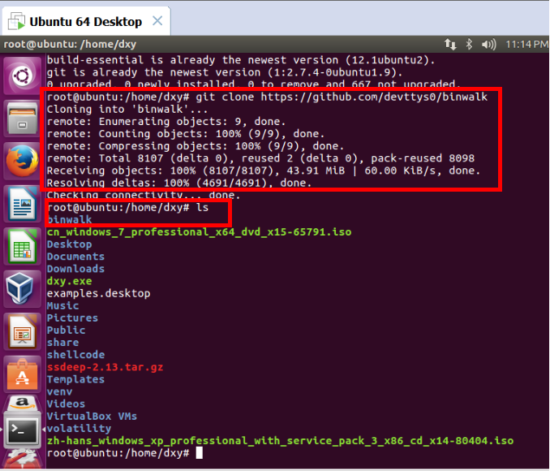  

  ```bash
  cd binwalk  
  sudo python setup.py install
  ```  
    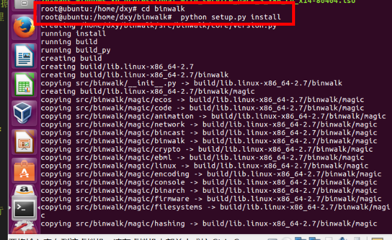   
* 【③】从[站点](https://people.debian.org/~aurel32/qemu/mips/)下载debianmips qemu镜像，由于虚拟机是Ubuntu linux，下载debian_squeeze_mips_standard.qcow2和vmlinux-2.6.32-5-4kc-malta即可：
    ```
    wget https://people.debian.org/~aurel32/qemu/mips/debian_squeeze_mips_standard.qcow2
    wget https://people.debian.org/~aurel32/qemu/mips/vmlinux-2.6.32-5-4kc-malta
    ```    
    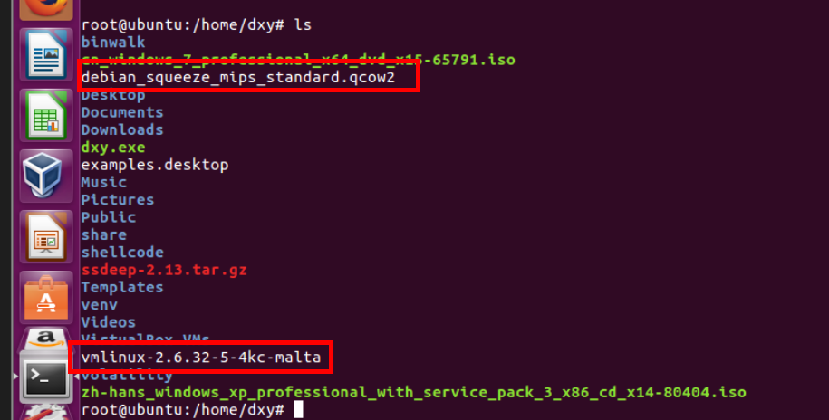   
* 【④】MIPS系统网络配置
  * 使用QEMU 模拟运行MIPS系统，需要将ubuntu虚拟机设置成桥接，这样以来ubuntu系统就可以和QEMU虚拟机进行通信和数据传输。                     
  * 获取安装依赖，执行以下命令：
    ```bash
    sudo apt-get install bridge-utils uml-utilities
    ```
  * 修改ubuntu主机网络配置，修改ubuntu的网络接口配置文件
    ```bash
    sudo vim /etc/network/interfaces

    auto lo
    iface lo inet loopback

    auto ens33
    iface ens33 inet manual
 
    auto br0
    iface br0 inet dhcp
    bridge_ports ens33
    bridge_maxwait 0
    ```  
    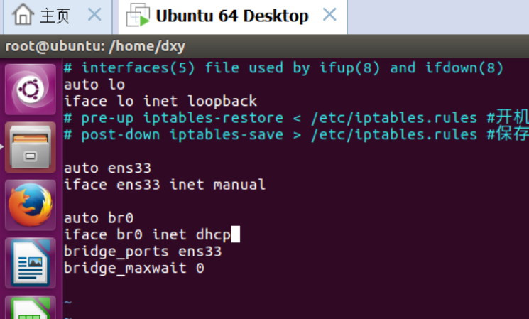    
  * 修改QEMU的网络接口启动脚本，重启网络使配置生效，执行以下命令：
    ```bash
    sudo vim /etc/qemu-ifup
    #在脚本文件/etc/qemu-ifup结尾增加如下内容：
    #!/bin/sh
    echo "Executing /etc/qemu-ifup"
    echo "Bringing $1 for bridged mode..."
    sudo /sbin/ifconfig $1 0.0.0.0 promisc up
    echo "Adding $1 to br0..."
    sudo /sbin/brctl addif br0 $1
    sleep 3
    ```   
    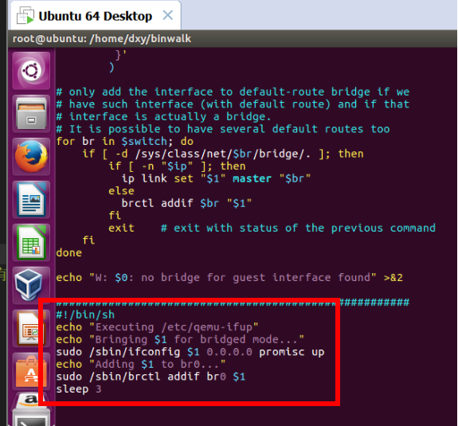                                         
  * 保存文件/etc/qemu-ifup 以后，赋予可执行权限，然后重启网络使所有的配置生效：
    ```bash
    sudo chmod a+x /etc/qemu-ifup
    sudo /etc/init.d/networking restart
    ```  
         
* 【⑤】QEMU启动配置
  * Qemu运行之前先启动桥接网络，在本地ubuntu命令行终端执行以下命令 
    * 注意：ens33为ubuntu默认网卡）
      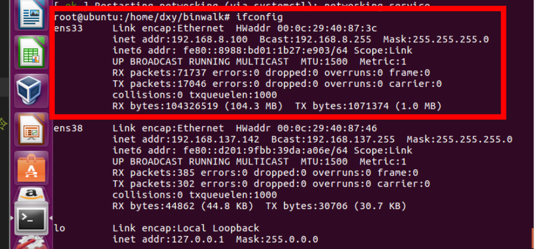    
    ```
    sudo ifdown ens33
    sudo ifup br0
    ```  
    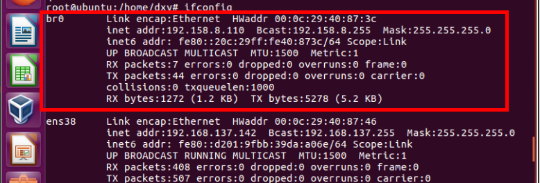     
* 【⑥】QEMU MIPS虚拟机启动
  * 进入前面下载的mips镜像目录，执行以下命令：
    ```
    sudo qemu-system-mips -M malta -kernel vmlinux-2.6.32-5-4kc-malta -hda debian_squeeze_mips_standard.qcow2 -append "root=/dev/sda1 console=tty0" -net nic,macaddr=00:16:3e:00:00:01 -net tap
    ```    
    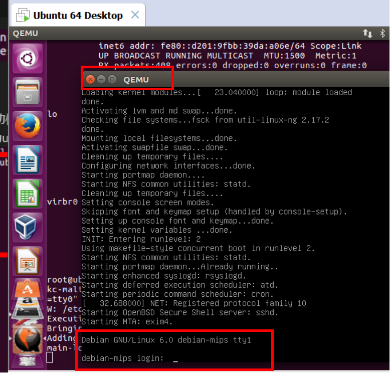  
  * 输入root/root便可登入qemu mips虚拟机   
      
* 【⑦】固件模拟运行
  * 从DLink官网下载[包含漏洞版本的路由器固件](ftp://ftp2.dlink.com/PRODUCTS/DIR-859/DIR-859_REVA_FIRMWARE_v1.05B03.zip)    
    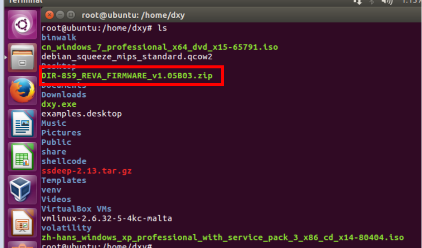   
  * 使用binwalk直接解压固件可得到文件系统文件：   
    ```
    binwalk DIR-859_REVA_FIRMWARE_v1.05B03.zip
    ```
        
  * 固件模拟运行由两种方式可以考虑：
    * 1、将文件系统上传到qemu mips虚拟机中运行
    * 2、借助firmadyne工具运行固件
  * 这里选用第二种方法，借助firmadyne工具运行固件

    * Firmadyne 是一款自动化和可裁剪的嵌入式 Linux 系统固件分析框架，它支持系统固件逆向 QEMU 嵌入式系统模拟执行，使用其可模拟路由器固件、执行路由器。
    * 注意：Firmadyne 安装之前，先安装 firmware-analysis-toolkit，安装完成之后在 firmware-analysis-toolkit 目录中创建 firmadyne 目录并下载安装 Firmadyne。各自全部安装完成后如下所示（注意两个工具须完全按照步骤安装完成，否则后续固件运行会出错）：
     ```bash
     git clone --recursive https://github.com/attify/firmware-analysis-toolkit.git
     ```   
     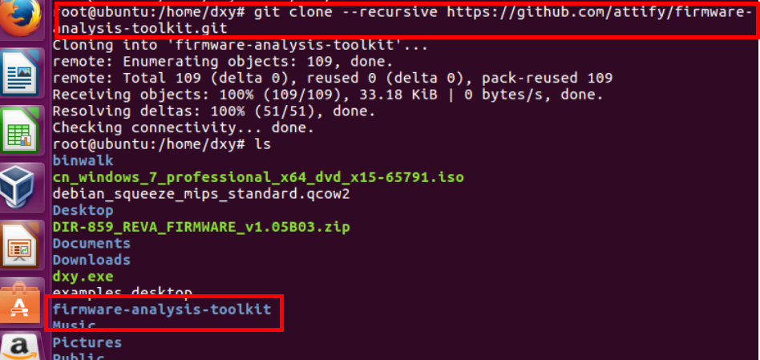     
  + 进入Firmadyne目录，下载Firmadyne。然后打开`firmadyne.config`，修改 FIRMWARE_DIR的路径为当前Firmadyne目录的绝对路径
    ```bash
    git clone https://github.com/firmadyne/firmadyne
    cd firmware-analysis-toolkit/firmadyne
  
    vim firmadyne.config
    # 以下为firmadyne.config中的内容
    FIRMWARE_DIR=/home/dxy/firmware-analysis-toolkit/firmadyne/
    ```  
        
    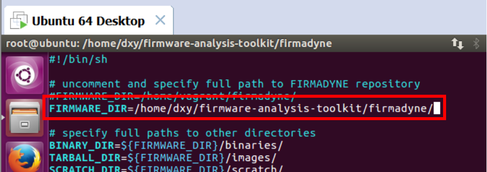  
  * 安装Firmadyne
    ```bash
    sh ./download.sh
    sudo ./setup.sh 
    ```  
    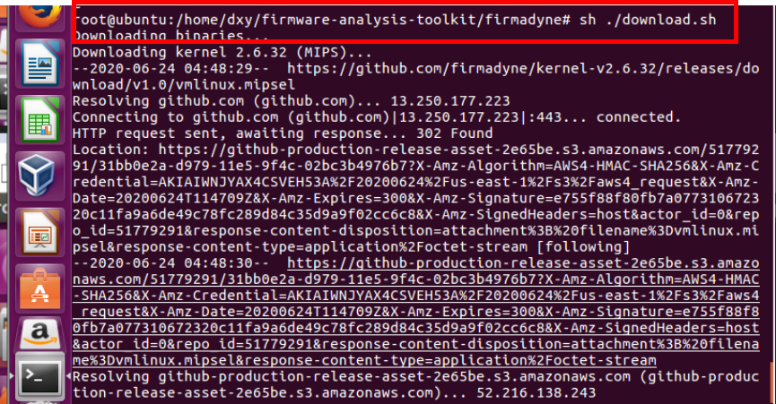    
    * 安装 Firmadyne 需要的其他环境，包括 QEMU
     ```bash
     sudo -H pip install git+https://github.com/ahupp/python-magic
     sudo -H pip install git+https://github.com/sviehb/jefferson
     sudo apt-get install qemu-system-arm qemu-system-mips qemu-system-x86 qemu-utils
    ```
  * 安装postgresql数据库
    ```bash
    sudo apt-get install postgresql
    #用户的用户名和密码设置为：firmadyne
    sudo -u postgres createuser -P firmadyne
    sudo -u postgres createdb -O firmadyne firmware

    # 注意这里的数据库文件是在firmadyne/目录下，也就是该命令要在根目录firmware-analysis-toolkit/目录下执行
    sudo -u postgres psql -d firmware < ./firmadyne/database/schema
    ```  
    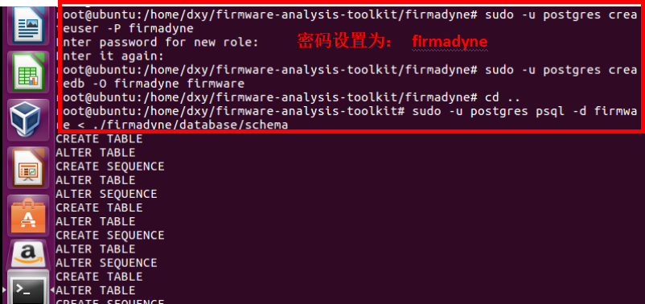    
  * 启动postgresql数据库
    ```bash
    sudo service postgresql start
    sudo service postgresql status
    ```       
           
  * 运行
    * 将 firmware-analysis-toolkit 目录下的 fat.py 和 reset.py 文件移动到 firmadyne 目录    
    * 修改fat.py中的执行权限、firmadyne的路径`firmadyne_path`以及root密码`root_pass`
      ```bash
      chmod +x fat.py
  
      vim fat.py
      #Configurations - change this according to your system
      firmadyne_path = "/home/dxy/firmware-analysis-toolkit/firmadyne"
      binwalk_path = "/usr/local/bin/binwalk"
      root_pass = "19990411"
      firmadyne_pass = "firmadyne"
      ```    
      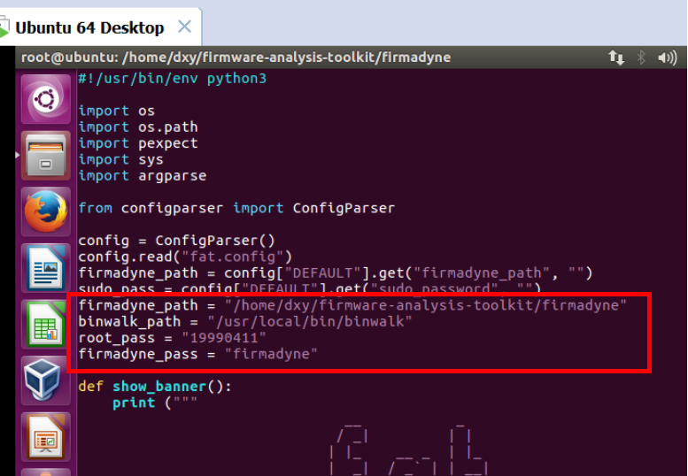      
    * 执行以下命令
      ```bash
      rm -rf images*
      python3 reset.py
      ./sources/extractor/extractor.py -b Dlink -sql 127.0.0.1 -np -nk "DIR-859_REVA_FIRMWARE_v1.05B03.zip" images
      ./scripts/getArch.sh ./images/1.tar.gz
      ./scripts/makeImage.sh 1
      ./scripts/inferNetwork.sh 1
      ./scratch/1/run.sh 
      ```  
      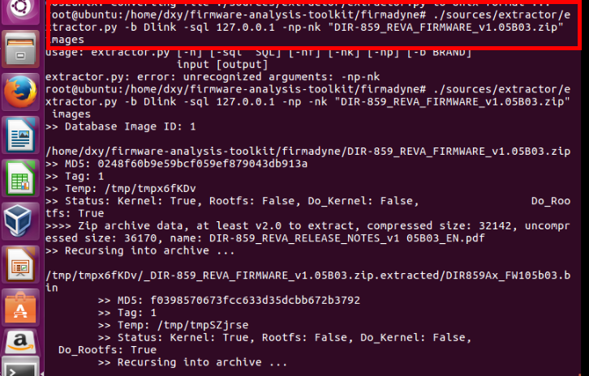   
      * 执行第三句时报错如图所示  
             
      * 解决办法：[安装sasquath](https://blog.csdn.net/yalecaltech/article/details/104244818) 
      * 再次执行第三句命令，成功   
        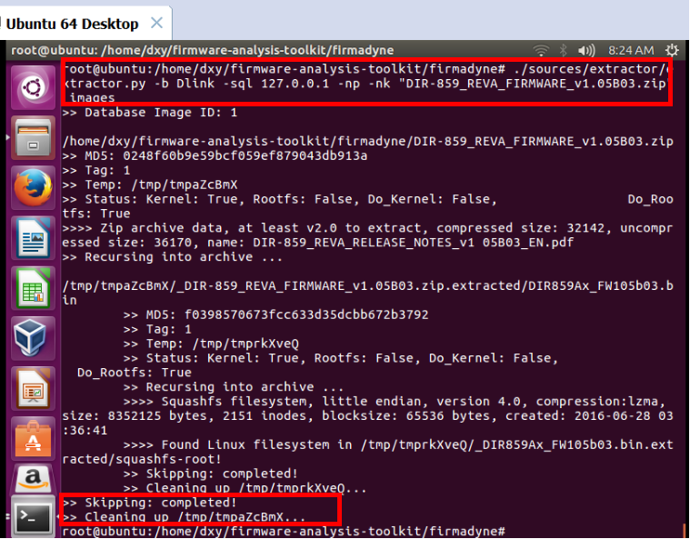     
      * 继续往下执行    
        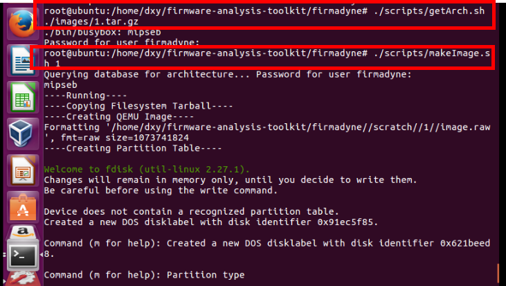        
        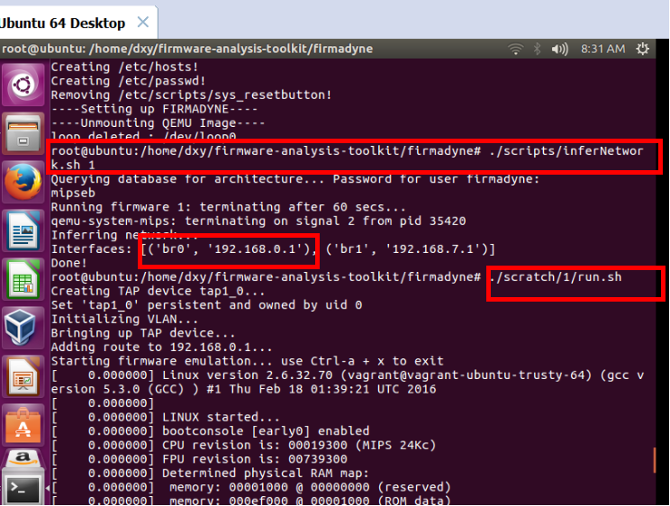   
        * 看到（'br0','192.168.0.1')
    * Ubuntu中打开浏览器，输入192.168.0.1即可访问仿真路由器：
      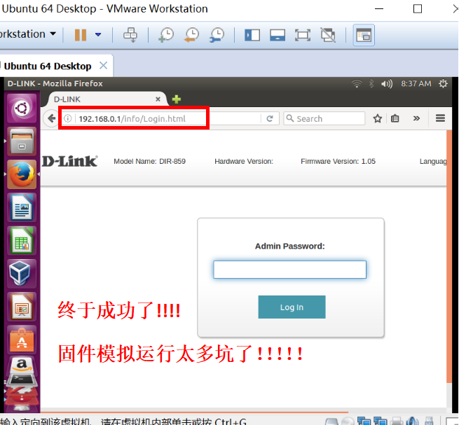   
* 【⑧】
***************************
## TIPs
* 鉴于国内下载速度特别不稳定,安装Firmadyne时的(sh ./download.sh)会失败或者很慢
  * 解决：在 https://github.com/liyansong2018/Firmadyne-binaries 手动下载后，通过共享文件夹传入虚拟机，直接放在 Firmadyne 的 binaries 目录下即可！！！！
* github中文件夹后面跟@+数字什么意思?为什么git clone下来里面是空的? 
  * 解决：https://www.cnblogs.com/TonyJia/p/12731162.html

***************************
## 参考文献
* 基于Firmadyne的固件模拟环境搭建 https://blog.csdn.net/song_lee/article/details/104393933  
  * 这个特别全特别好！！！！！强推！！！！
* DLink RCE 漏洞 CVE-2019-17621 分析 https://www.geekmeta.com/article/1292672.html
* GitHub release文件下载失败问题 https://blog.csdn.net/k741451/article/details/89510233
