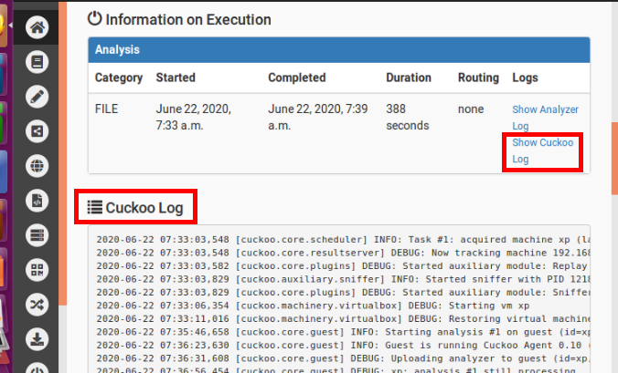

## 作业要求
* 安装并使用cuckoo，任意找一个程序，在cuckoo中trace获取软件行为的基本数据

## Cuckoo介绍 
* Cuckoo 是一款用 Python 编写的开源的自动化恶意软件分析系统，它的主要功能有：
  * 跟踪记录恶意软件所有的调用状况；
  * 恶意软件文件行为：恶意软件执行过程中创建新文件、修改文件、删除文件、读取文件或下载文件的行为；
  * 获取恶意软件的内存镜像；
  * 以 PCAP 格式记录恶意软件的网络流量；
  * 获取恶意软件执行过程中的屏幕截图；
  * 获取执行恶意软件的客户机的完整内存镜像
* Cuckoo 可以分析的文件类型包括但不限于：  
  * Windows 可执行文件
  * DLL 文件
  * PDF 文件
  * MS Office 文件
  * URL 和 HTML 文件
  * PHP 脚本文件
  * CPL 文件
  * VB 脚本文件
  * ZIP 压缩包
  * JAR 文件
  * Python 脚本文件
  * APK 文件
  * ELF 文件


## 实验环境
  * 主机：Ubuntu 16.04
  * 客机：Windows xp
***************************
## 实验过程

### 【1】主机配置
* 安装依赖包    
    ```bash
    $ sudo apt-get install python python-pip python-dev libffi-dev libssl-dev
    $ sudo apt-get install python-virtualenv python-setuptools
    $ sudo apt-get install libjpeg-dev zlib1g-dev swig
    $ sudo apt-get install mongodb
    $ sudo apt-get install postgresql libpq-dev
    $ sudo apt-get install qemu-kvm libvirt-bin ubuntu-vm-builder bridge-utils python-libvirt
    $ sudo pip install XenAPI
    $ sudo apt-get install git mongodb libffi-dev build-essential python-django python python-dev python-pip python-pil python-sqlalchemy python-bson python-dpkt python-jinja2 python-magic python-pymongo python-gridfs python-libvirt python-bottle python-pefile python-chardet tcpdump -y
    ```    
    * 安装无误      
        
* 安装Tcpdump
    ```bash
    # install Tcpdump
    sudo apt-get install tcpdump apparmor-utils
    sudo aa-disable /usr/sbin/tcpdump
    ```
    * 确认安装无误
    ```bash
    # to make sure it is correctly installed 
    sudo setcap cap_net_raw,cap_net_admin=eip /usr/sbin/tcpdump
    getcap /usr/sbin/tcpdump
    # right output:
    # /usr/sbin/tcpdump = cap_net_admin,cap_net_raw+eip
    ```      
           
* 安装Volatility：
    ```bash
    #先安装依赖
    $ sudo pip install openpyxl
    $ sudo pip install ujson
    $ sudo pip install pycrypto
    $ sudo pip install distorm3
    $ sudo pip install pytz 
    #然后安装volatility
    $ git clone https://github.com/volatilityfoundation/volatility.git
    $ cd volatility
    $ python setup.py build
    $ python setup.py install
    ```
    * 确认安装无误
    ```bash
    $ python vol.py -h
    # rightOutput: Volatility Foundation Volatility Framework 2.6.1
    ```      
               
* 安装Cuckoo：
    ```bash
    #安装以下依赖
    $ sudo apt-get install libtiff5-dev libjpeg8-dev zlib1g-dev libfreetype6-dev liblcms2-dev libwebp-dev tcl8.6-dev tk8.6-dev python-tk
    # 安装cuckoo
    $ virtualenv venv
    # ！！！注意不要在root下进行安装！！！回到普通用户！！！！
    $ . venv/bin/activate
    (venv)$ pip install -U pip setuptools
    (venv)$ pip install -U cuckoo
    ```
  * 确认安装无误；启动cuckoo
    ```bash
    cuckoo -d
    ```        
               
  * 检查是否生成CWD文件：文件路径：/home/dxy/.cuckoo/agent/agent.py
    * 如果没有出现.cuckoo文件，因为它是隐藏文件可以使用快捷键ctrl+H显示隐藏文件      
               
************************
### 【2】客机配置（配置win7虚拟机）
* 一块hostonly网卡     
              
            
* 开启win7系统，在内部操作配置ip地址         
      
* 关闭防火墙、关闭Windows update自动更新       
     
* 相互连通，但是客机不能上网    
  * 主机可以ping通客机     
         
  * 客机可以ping通主机    
       
  * 此时客机不能上网    
        
* 在Ubuntu中设置IP报文转发，win7要通过主机的流量转发服务才能访问网络
  ```bash
  $ sudo vim /etc/sysctl.conf
  #添加这行
  net.ipv4.ip_forward=1 
  ```     
       
* 使用iptables提供NAT机制
  ```bash
  # ens33是ubuntu主机中的网卡名字，根据情况更改
  $ sudo iptables -A FORWARD -o ens33 -i vboxnet0 -s 192.168.56.0/24 -m conntrack --ctstate NEW -j ACCEPT
  $ sudo iptables -A FORWARD -m conntrack --ctstate ESTABLISHED,RELATED -j ACCEPT
  $ sudo iptables -A POSTROUTING -t nat -j MASQUERADE
  $ sudo vim /etc/network/interfaces
  # 新增下列兩行
  pre-up iptables-restore < /etc/iptables.rules #开机自启动规则
  post-down iptables-save > /etc/iptables.rules #保存规则
  ```      
      
  * 然后执行
  ```bash
  $ sudo apt-get install iptables-persistent
  $ sudo netfilter-persistent save
  #dns
  $ sudo apt-get install -y dnsmasq
  $ sudo service dnsmasq start
   ```
* 操作完成后win7客机可以上网了！！！        
      
* 安装python环境、PIL等
  * 主机Ubuntu和x客机p之间共享文件夹，将python安装包等传送给xp系统，包括/home/dxy/.cuckoo/agent/agent.py,但是把后缀改为.pyw    
            
             
  * 双击安装python27
  * 双击安装PIL 
  * 将agent.pyw拷贝到安装后的python27文件夹中，并双击运行
    * 打开cmd，输入netstat -a，观察到8000必须要在监听状态下，这个条件满足后，之后的样本分析才能连接成功      
        
  * xp当前状态生成快照，取名为snapshot，以便样本分析       
       
************************   
### 【3】cuckoo配置 
  * （待配置的文件在/home/dxy/.cuckoo/conf/ 下）     
          
  * 配置virtualbox.conf
    ```bash
    $ vim virtualbox.conf
    machines = xp       #VirtualBox中客机虚拟机名称
    [xp] 
    label = xp 
    platform = windows
    ip = 192.168.56.101 #VirtualBox中客机虚拟机IP
    snapshot = snapshot #VirtualBox中客机虚拟机快照名称
    ```       
            
  * 配置reporting.conf
    ```bash
    $ vim reporting.conf
    [jsondump]
    enabled = yes # no -> yes
    indent = 4
    calls = yes
    [singlefile]
    # Enable creation of report.html and/or report.pdf?
    enabled = yes # no -> yes
    # Enable creation of report.html?
    html = yes # no -> yes
    # Enable creation of report.pdf?
    pdf = yes # no -> yes
    [mongodb]
    enabled = yes # no -> yes
    host = 127.0.0.1
    port = 27017
    db = cuckoo
    store_memdump = yes 
    paginate = 100
    ```
  * 配置cuckoo.conf
    ```bash
    $ vim cuckoo.conf
    version_check = no
    machinery = virtualbox
    memory_dump = yes
    [resultserver]
    ip = 192.168.56.1
    port = 2042
    ``` 
  * 配置完成
  ****************************
### 【4】启动cuckoo
```bash
cuckoo
```
* 运行发现mongodb出错       
        
  * 查看mongodb状态，发现failed       
        
  * 查看mongodb的日志文件，发现问题出现在磁盘空间不足
    * cat /var/log/mongodb/mongodb.log       
           
  * 按照提示用 `mongod --smallfiles`启动mongodb之后，运行成功      
              
* 启动成功后，另外开出一个控制台，启动cuckoo web服务
  ```bash
  cuckoo web runserver
  ```     
            
* 进入上图给予的网站：        
              
* 提交一个待分析exe程序 
  * 本实验我提交的是自己写的dxy.exe文件     
       
* 分析完成  
      
* 分析结果
  * 可以查看这么多内容    
        
  * 简单看一下summery的内容     
          
        
       
  * 静态分析    
        
  * 其他的分析数据就不截图了，太多啦~

### 【end】实验成功！流下了激动的泪水！！！太多坑了T……T

**************************

## 参考资料
* cuckoo环境搭建从零开始（适合第一次搭建的小白）：https://blog.csdn.net/baobaoyu_/article/details/103047082  
