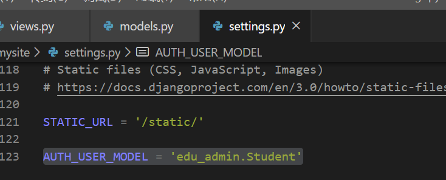

# 课堂实验
* views是Django功能实现应用功能的地方。如果想写一个动态的页面，就在views中定义一个函数。
* 最基本的views函数，是收到一个HttpRequest类型的参数，需要返回一个HTTPResponse类型的返回值。
* 在edu_admin中的views.py写入一下内容  
    
* 写好了以后，还需要把这个views，对应到一个路径上。也就是客户端如何调用这个views函数对应的功能。因为一个实用的web app只有一个views是不够的，可能有很多很多views。然后需要把这些views对应到不懂的url上。这样客户端才能访问。这个工作，是urls.py来完成的。  
     
* 然后需要配置urls.py，也就是mysite的urls.py中包括这个url配置。这是为了适应可能有多个Django app共同工作的情况。 
     
* 运行。pk就是参数，而且只允许整数。    
       
     
* 说明 urls和views配合工作成功。用户在浏览器中输入路径，django把这个url对应到一个views函数上。views函数处理HttpRequest。返回HttpResponse。
* 修改view.py，在views函数中访问数据库。
  * 先从models中导入模型类。
  * 然后调用这个模型类的objects的filter方法，就完成了一次sql select。filter函数的参数是就相当于查询的过滤条件。
  * 要查询的是student为当前登录用户的Score表的记录
* 还需要修改一下模型。
  * Django是有默认的用户管理系统的。用户相关的数据库表结构其实Django已经建立好了。但是这里用了student表来作为系统用户。所以要告诉Django不要用系统默认的用户模型了，用Student。       
           
  * 告诉Django，使用 edu_admin 的Student作为用户管理登录授权的模型。   
             
  * 代码修改完以后。由于涉及到数据库修改，所有要进行数据库表结构的migrate     
       
     
* 下面，我们尝试在数据库中写入一些数据。然后测试看看Django的数据库访问是否正常。
  * 最原始的方法就是在sqlite.exe 中用sql语句插入。但是这个方法容易把数据搞乱了。
  * 用Django的方式，先建立一个超级管理员用户python manage.py createsuperuser。建立好了以后，然后可以用Django的admin功能，用超级管理员录入数据。Django的admin相当于一个数据管理的超级权限后台，可以直接操作数据库
  * 访问 http://127.0.0.1:8000/admin/ 刚才新建的用户登录后看到这个页面。    
    
  * 可以录入一些课程，学生和成绩了    
    
* 当数据库有了值以后就可以在view中验证查询自己成绩的功能是否正常了。
    * views中的@login_required表示需要登录。我这里已经用超级管理员登录了，所以是可以访问的。
    * render是一个Django内置的函数。用于在模板文件的基础上，通过渲染得到动态的网页效果。其中 score.html是模板后面的{} dict是参数
    * 然后render函数就会在模板html文件的基础上，生成一个html
    * 注意，写了新的views函数，需要增加url     
            
           