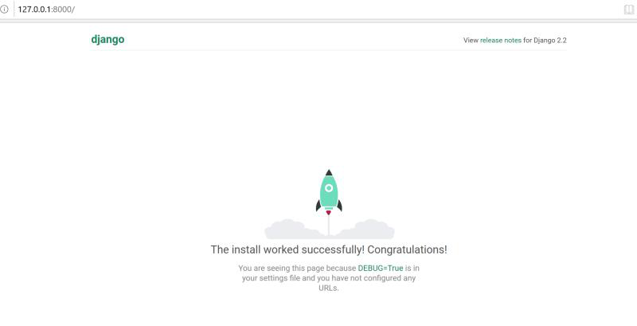
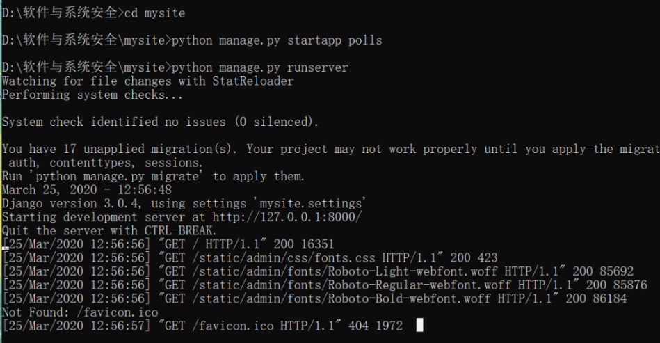
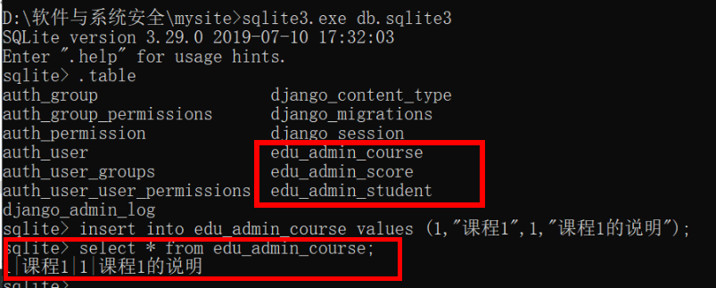

# 课堂实验
## 基础准备
* 安装 django  pip install Django
* 执行 django-admin startproject mysite
* cd  mysite
* python manage.py startapp polls
* python manage.py runserver
* 四个命令，构建了一个基于Django的基本框架的web应用程序。
  可以访问 http://127.0.0.1:8000/ 看到结果
* 在命令行里，可以看到服务器的打印输出，表示服务器收到了 request。看到的页面就是框架自动返回给大家的response。说明，request和response，请求相应的处理过程已经搭建起来了。  
      
       

# Django框架的基本编程的结构
* 编写大型程序的时候，一定要做到mvc分离，m数据模型，我们要先建立基础的底层的数据结构，然后处理用户输入，构建每个用户输入对应的处理函数，就是c 控制。然后在底层m数据模型的基础上，绘制用户界面。我们把这个叫做封装。这是基本的编程思想，和正确的工作组织流程。
* 大到一个复杂的大型web程序时，其实底层思想还是mvc，只是换了个名字，叫mvt，t是页面模板。
* 写Django的程序，或者任何框架程序。主要就是写三大部分
   * 第一，数据模型，models
   * 第二，views和url。是用户请求对应的处理程序。
   * 第三，前端页面模板。处理完的结果如何显示的问题。  
   * 其中url部分，又称为路由。是把用户请求的url，对应到处理函数的过程。Django的处理函数，有一个专门名称，叫views。其基本过程就是框架收到用户的request ，其中有UR，框架根据urls.py中的配置。将用户请求对应到一个处理函数，一般在views.py中。views.py中的函数，参数就是request对象，Django中是HttpRequest类。然后views函数需要返回一个HTTPResponse类型的request，Django把这个reqeust变化为http协议的request数据包，返回给浏览器。
* 一般在views的处理过程中，会访问数据库，也就是models。models把底层的数据库操作，比如sql全部封装为了对象化的处理。比如底层操作数据库是用sql语句，所以我们最原始的web程序，一般会程序员拼装sql语句。
* 但是在Django中不用。我们把这种底层数据的封装，称为orm。程序员只需要写好这个models.py文件。所有的建表的操作框架就可以完成。
  * 把建表代码直接放入edu_admin中的models.py。
  * 然后，我们需要把这个表结构写入到数据库中，也就是create table的过程，django称为migrate。
  * 打开 mysite的settings.py，在 INSTALLED_APPS 增加一个 edu_admin，表示 edu_admin 这个是我们这个site的一个app，之前startapp命令只是创建了app，必须要把app写入到这里，这个app才会被纳入到站点功能中。
  * 然后 python .\manage.py makemigrations ， python .\manage.py migrate然后会出现一个 db.sqlite3文件，数据库表结构就建立完成了。
  * 执行sqlite3.exe db.sqlite3，进入到sqlite的命令行以后 执行 .table命令。然后可以看到所有的表，其中后三个表是我们在models中定义的，其他表是Django自己要用的。   
      