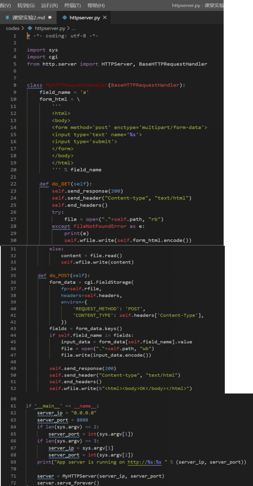
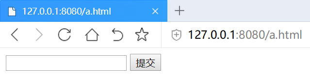
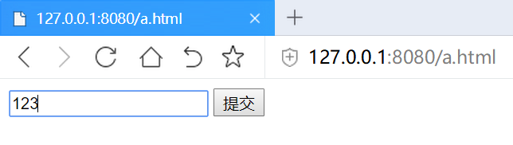
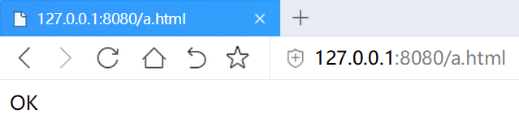
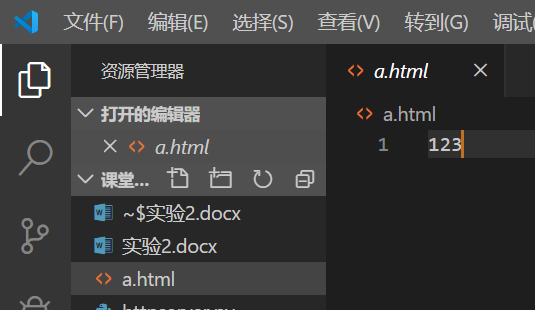
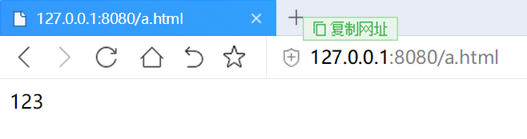
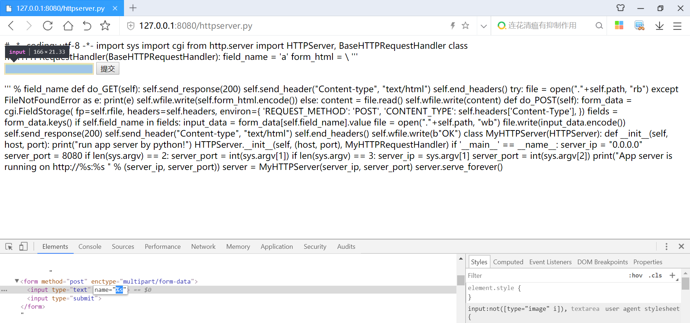
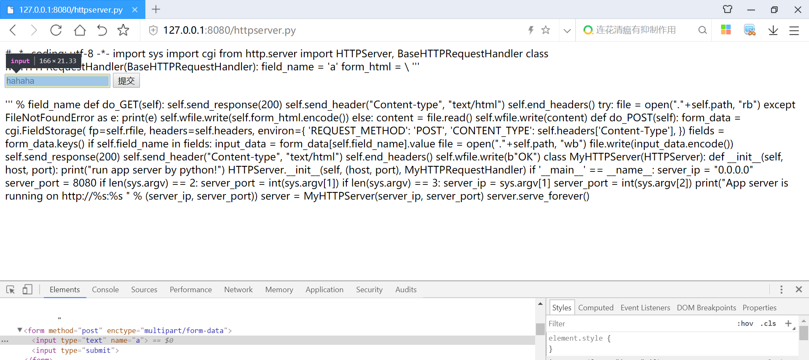
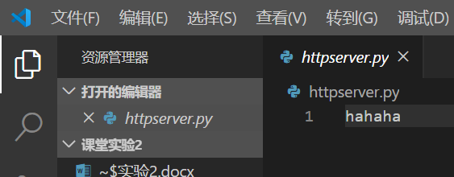

# 课堂实验
* 运行 httpserver.py  
     
* 58行指定了 MyHTTPRequestHandler 来处理 http请求，那么当用get方法请求，就会调用 do_GET,POST方法请求，调用 do_POST函数
* 27行self.path 是请求的路径。比如，我们这里的 http://127.0.0.1:8080/a.html 其中 http://127.0.0.1:8080是协议服务器地址和端口。/a.html就是路径。
* 这里做了一个特殊的处理，如果指定的文件不存在，还是返回200，表示请求路径是正确的，可以处理，然后返回一个默认的页面，这个页面就是form_html的变量，在FileNotFoundError异常处理过程中写回，这一段 html 浏览器渲染出来，就是那个带一个编辑框的表单，表单指定了使用post方式向服务器提交数据。    
     
* 下面可以在表单中填入数据。点提交按钮。然后服务器的do_POST函数回被调用。这里通过 cgi.FieldStorage解析了客户端提交的请求，原始的请求的头部在self.headers。body部分在self.rfile，解析完成以后放到 form_data变量里，其中form_data['field_name'].value   
     
* 通常，一个服务器会根据业务逻辑处理用户提交的数据，比如用户发表的商品评论，你们在我的在线教学系统中填入的作业，一般会写入数据库，我们这里为了模拟这个过程，简化了一下，没有用户系统，也没有数据库。直接写入了文件，而且是写入path对应的文件，如果写入成功，就返回一个200状态的OK。  
     
    
* 但与之带来的就是漏洞，如果填入了 123 那么123被写入了a.html文件，执行完成后，你的目录下会多一个a.html，内容为123，然后你下次再访问 http://127.0.0.1:8080/a.html 时，在浏览器地址栏里回车，由于这个时候a.htm已经存在了所以是运行的31-33行的else部分，直接把文件内容会写给浏览器，这里时在简化模拟用户提交数据-存入数据-其他用户获取这个数据的过程，这里有就XSS漏洞了。   
     
* 同理可以实现弹框、页面跳转等效果
* 还有更严重的漏洞，如果大家在浏览器中访问http://127.0.0.1:8080/httpserver.py，由于服务器没有做任何过滤，只要是存在的文件，就发送给客户端，源代码文件也发送给了客户端。现在黑客可以知道我整个后台的逻辑了。如果还有一些配置文件，比如数据库地址和访问口令等。  
    
* 更严重的是，黑客甚至可以注入后端代码。由于我们是回写到文件，你可以构造一个http post请求，把httpserver.py文件改写了。到调试工具的 elements那里，由于后台只处理名为a的表单项，所以我们需要把input的name改为a，然后填写并提交表单，看到httpserver.py，它变了，变成了我们填写的表单内容.    
    
     
* 所以，我们甚至可以给后端注入代码。当然，如果只是注入一个hahaha 服务器就挂了。再也跑不起来了。因为他不是一个可以运行的python，所以，这是一个及其简单，但是漏洞百出的web服务器。这就是不做任何过滤，直接写入数据的危害。
